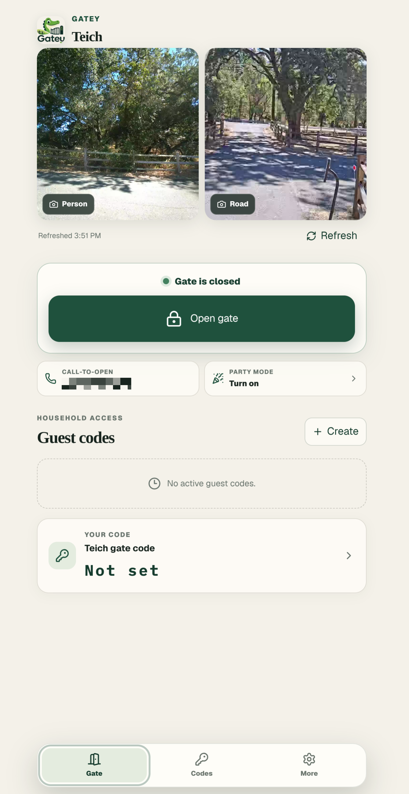
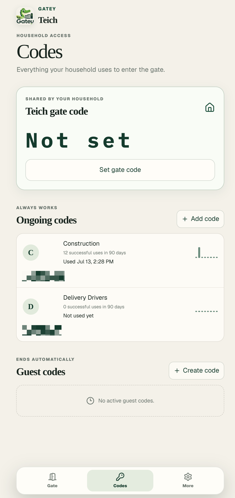
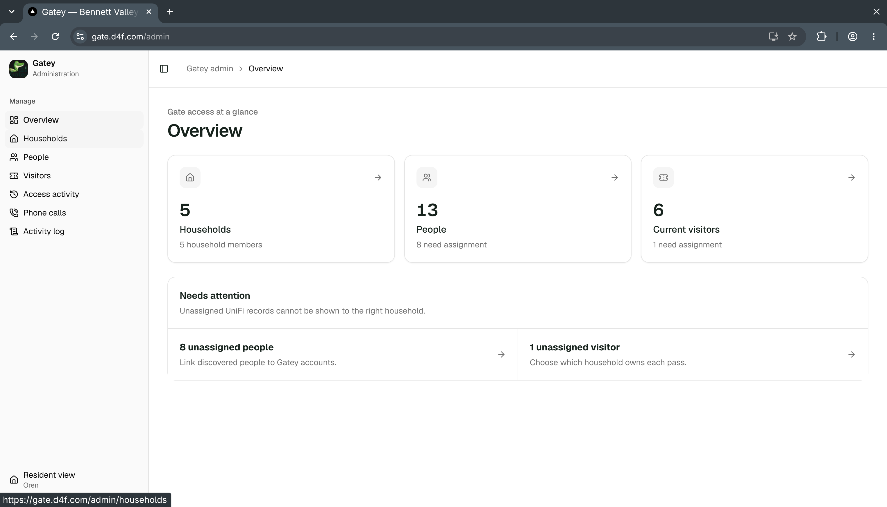
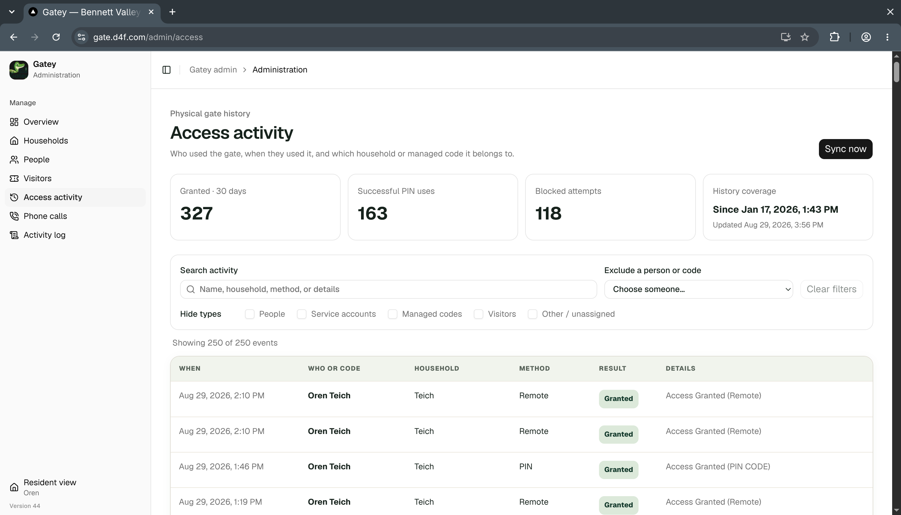

# Gatey

Gatey is a self-hosted web app for managing a shared residential gate through UniFi Access. Residents get a mobile interface for everyday access, while administrators manage households, people, visitors, and access history.

## Features

- View gate camera snapshots, check the gate state, and open the gate remotely.
- Create household, ongoing, and time-limited guest codes.
- Schedule party mode to hold the gate open for part of the day.
- Let authorized residents open the gate by phone with optional Twilio call-to-open.
- Organize UniFi people and visitors by household, with searchable access activity and an administrative audit log.

## Resident experience

Residents can operate the gate and manage the codes that belong to their household from an installable mobile web app.

<p align="center">
  
  &nbsp;
  
</p>

## Administration

The administration interface connects UniFi records to households and provides a record of gate activity.





## Requirements

- Node.js 26 or later
- A UniFi Access controller
- `ffmpeg` for camera snapshots
- A Twilio number for call-to-open, if used

## Development

Install dependencies, copy `.env.example` to `.env`, and configure the required values for your environment. Then initialize the database and start the development server:

```bash
npm install
npm run db:migrate
npm run auth:create-admin
npm run dev
```

Run the project checks with:

```bash
npm test
npm run lint
npm run build
```
