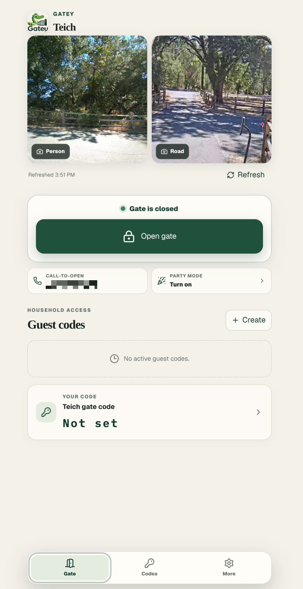
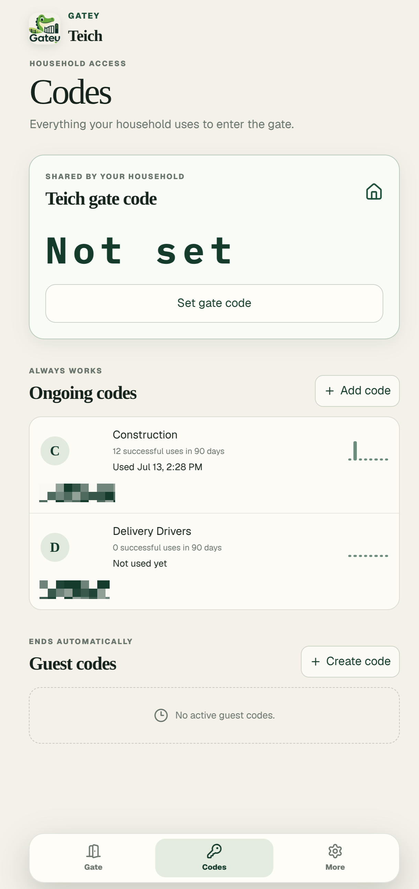
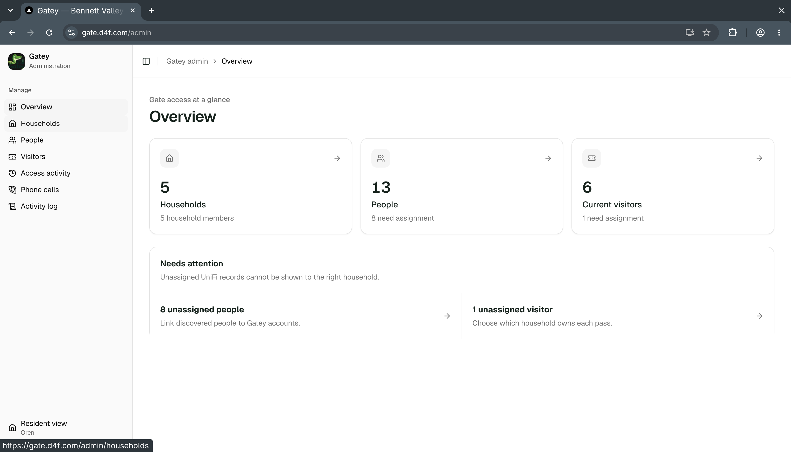
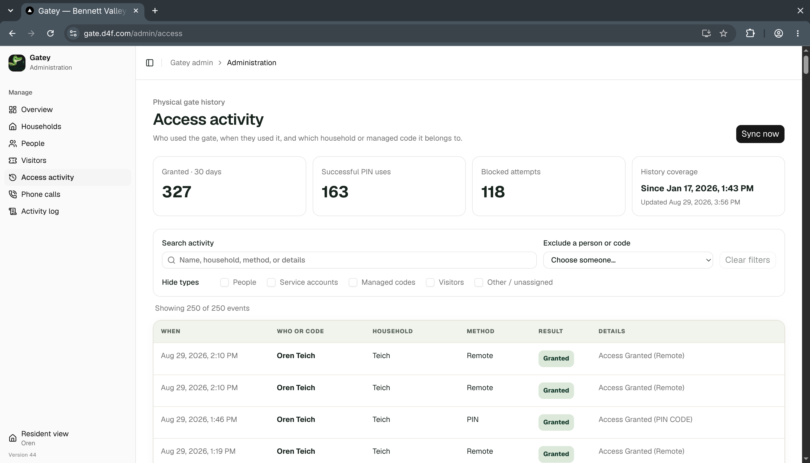

# Gatey

Gatey is a self-hosted web app for managing a shared residential gate through UniFi Access. Residents get a mobile interface for everyday access, while administrators manage households, people, visitors, and access history.

## Features

- View gate camera snapshots, check the gate state, and open the gate remotely.
- Create household, ongoing, and time-limited guest codes.
- Schedule party mode to hold the gate open for part of the day.
- Let authorized residents open the gate by phone with optional Twilio call-to-open.
- Connect Apple Shortcuts for an iPhone arrival-geofence pilot, without uploading location.
- Organize UniFi people and visitors by household, with searchable access activity and an administrative audit log.

## Resident experience

Residents can operate the gate and manage the codes that belong to their household from an installable mobile web app.

<p align="center">
  
  &nbsp;
  
</p>

## Administration

The administration interface connects UniFi records to households and provides a record of gate activity.





## Requirements

- Node.js 26 or later
- A UniFi Access controller
- `ffmpeg` for camera snapshots
- A Twilio number for call-to-open, if used

## Development

Install dependencies, copy `.env.example` to `.env`, and configure the required values for your environment. Then initialize the database and start the development server:

```bash
npm install
npm run db:migrate
npm run auth:create-admin
npm run dev
```

Run the project checks with:

```bash
npm test
npm run lint
npm run build
```

## iPhone arrival pilot

After deploying this change and running `npm run db:migrate`, residents can open
**More → Open on arrival** (or `/shortcuts`). `BETTER_AUTH_URL` must be the public
HTTPS origin residents use; the phone must be able to reach it over cellular.
There are no new services or secrets to configure. Start with the two pilot
neighbors; the setup page itself is available to all signed-in household members.

1. Download **Open Gatey**, open the downloaded `.shortcut` file in Shortcuts,
   and add it. Keep its name unchanged.
2. Back in Gatey, create a connection link and tap **Connect this iPhone**.
   Approve the network and file permissions in Shortcuts. Pairing does not open
   the gate. The link expires after ten minutes and works once.
3. Run the shortcut manually once while at the gate. This **does open the gate**
   and establishes any remaining permissions before an unattended arrival.
4. Add an **Arrive** automation centered on the gate, initially around a
   200-meter radius, **Any Time**, **Run Immediately**, running **Open Gatey**
   with no input. On newer iOS versions, add the automation inside the shortcut.
5. Drive outside the circle and return with the phone locked. Record whether
   opening is early, on time, late, or missed; adjust the radius against the
   gate's opening/closing cycle. Test cellular coverage at the boundary.

The shared download contains no credentials. Pairing exchanges a random code
for an opening-only token and saves the response in
`iCloud Drive/Shortcuts/Gatey-connection.json`. Enable iCloud Drive and keep the
file downloaded if Files offers that option. This is a pilot storage choice,
not Keychain: the file contains a bearer credential and can sync to devices on
the same Apple Account. Do not share that file. The shortcut stores one Gatey
connection at a time. No location coordinates are sent to Gatey.

Gatey stores only SHA-256 hashes of random 256-bit codes/tokens. Each resident
has one active key per household; successful re-pairing replaces it. Opening
rechecks membership and bans, records `gate.open` with `source: shortcut`, and
suppresses repeat requests for 30 seconds, including after controller errors.
**Disconnect shortcut access** revokes both the opening key and unused pairing
links; disable the arrival automation separately on the phone. No queued or
automatic retries are used. Normal Gatey access remains the fallback.

### Shortcut maintenance and validation

`scripts/build-shortcut.py` generates the readable plist and signs the shared
download with Apple's macOS `shortcuts sign --mode anyone`. The signed file is
checked in under `public/shortcuts`, so the Linux server needs no signing tools.
To regenerate after editing actions, run this on a Mac with Shortcuts/iCloud:

```bash
python3 scripts/build-shortcut.py
```

The script also supports `--unsigned-only` for source inspection on other OSes.
Signing may require running outside a restrictive filesystem sandbox. Never
embed production credentials in this shared artifact.

Validated in this change: pairing/access route tests, full test suite, lint,
production build with a disposable migrated database, an HTTP smoke test of the
authenticated setup/download/pair/revoke flow, Apple signing, and native
Shortcuts import-preview/action inspection. An actual iPhone pairing, locked-phone
file access, and drive-through timing still need to be verified at the gate.
